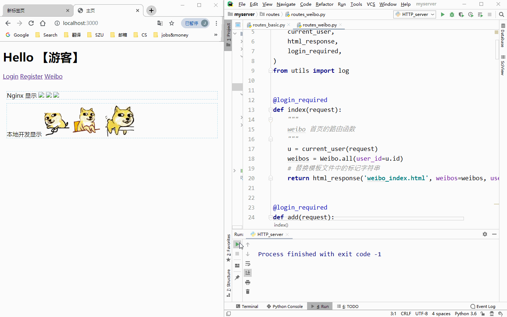

基于原始 Socket 连接, 从无到有打造 HTTP & WSGI Web 服务器---自制 MVC Web 框架---基于自制框架实现的 Demo APP (用于演示)
===

简介
---

- SERVER:
    - 起点是一个 Socket 链接
    - 面向的请求协议经过了一次升级:
        - HTTP 协议
            - 可以 解析/拼接 HTTP 报文, 完全胜任后端服务器 请求/响应 需求.
        - WSGI 协议
            - 针对 WSGI 协议进行上层 API 封装, 对 WSGI 请求响应的数据格式做清洗 可成功解析 WSGI 请求并成功响应.
            - 支持 WSGI 协议之后, 可用 Gunicorn 应用服务器托管自制的 Web MVC 框架
    - 多线程处理请求
    - 交付请求至相应路由, 获得处理结果
- MVC 框架:
    - Model:
        - 基于 JSON 文件键值对 (表) 实现数据持久化, 类似 Nosql 类数据库. 被替换为 Mysql
        - 自制基于 MySQL 语句的 ORM
            - 提供底层 Model 基类, 实现最常用增删改查类方法
                - 方法根据 参数&具体子类 拼接 sql 语句
            - 具体 Model 如 User, Weibo 继承基类
    - View:
        - 利用 Jinja2 渲染
    - Control: 
        - 用字典映射 url-route, 用多表 update 实现类似 flask 蓝图管理, 利用了 Python 的高阶函数
            
            
功能演示
---

- **HTTP + MVC / 本地开发演示:**
    - 请求报文解析:
        - 
    - 响应报文解析:
        - 
    - 权限验证装饰器:
        - 
    - 基于自制 MVC 框架开发的 Demo APP:
        - 

- **WSGI + MVC / (Ubuntu + Nginx + Gunicorn) linux 部署演示:**
    - 
